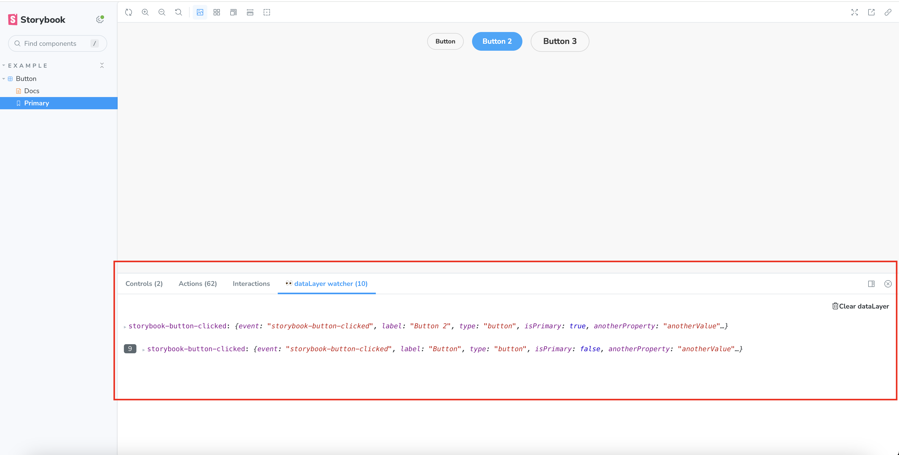

# storybook-addon-datalayer-watcher

## Installation

First, install the package.

```sh
npm install --save-dev storybook-addon-datalayer-watcher
```

Then, register it as an addon in `.storybook/main.js`.

```js
// .storybook/main.ts

// Replace your-framework with the framework you are using (e.g., react-webpack5, vue3-vite)
import type { StorybookConfig } from '@storybook/your-framework';

const config: StorybookConfig = {
  // ...rest of config
  addons: [
    '@storybook/addon-essentials'
    'storybook-addon-datalayer-watcher', // 👈 register the addon here
  ],
};

export default config;
```

## Usage

This addon allows you to debug GTM dataLayer events in Storybook.

If your component pushes to the dataLayer array (directly or using a library), you can interact with it in Storybook and see the GTM events it triggers.



## Storybook versions support

This addon supports all versions of Storybook starting `7.0`

Please see the table bellow to see which addon version supports which Storybook versions.

| Version | Supported Storybook versions |
|---------|------------------------------|
| 1.x     | >= `7.0`, < `9.0`            |
| 2.x     | >= `9.0`                     |


## Credits

Thanks [@cmarcchen](https://github.com/cmarcchen) for the idea
